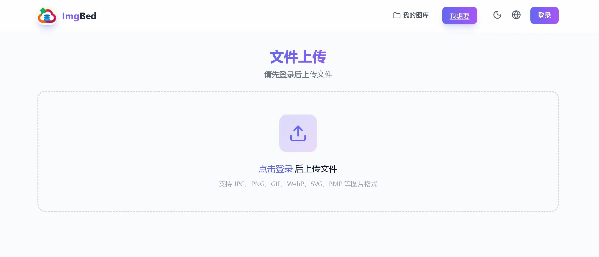
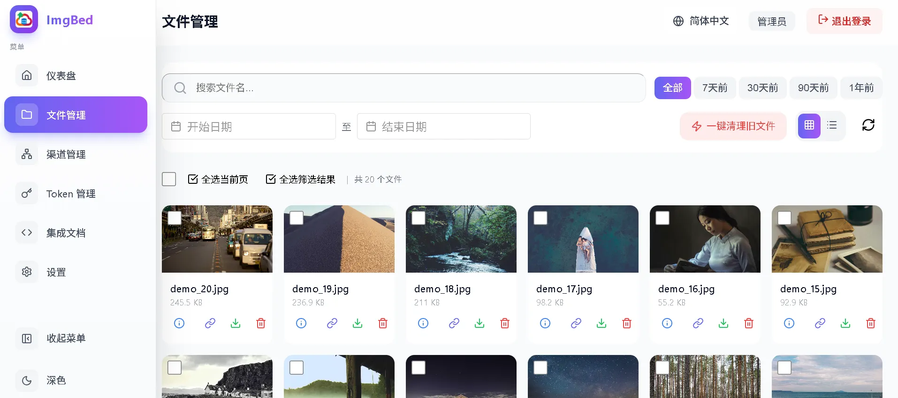
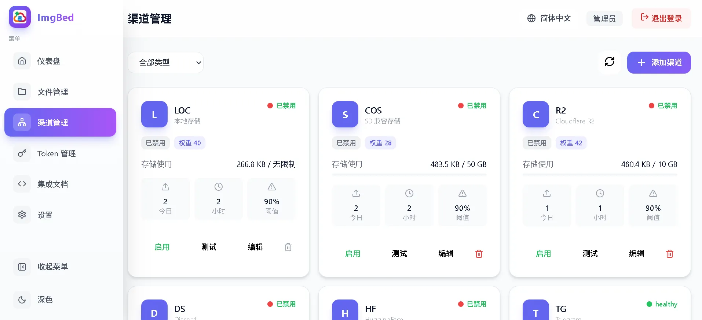
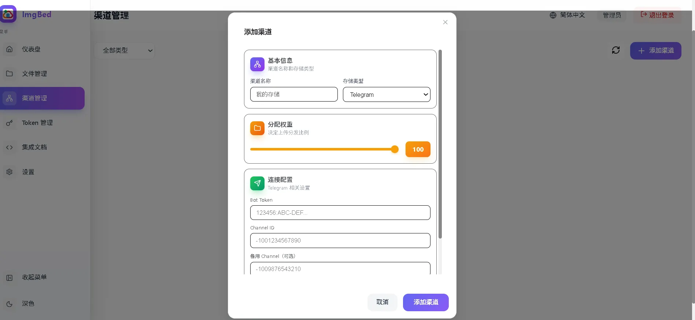
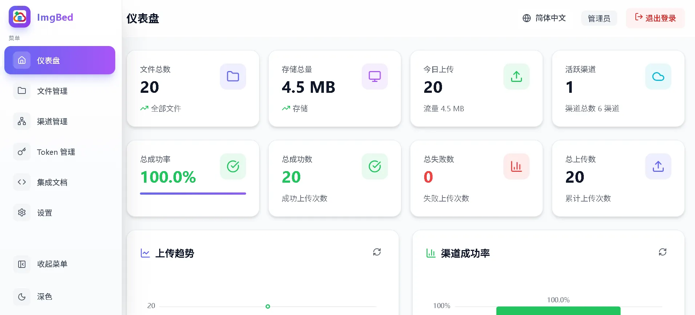
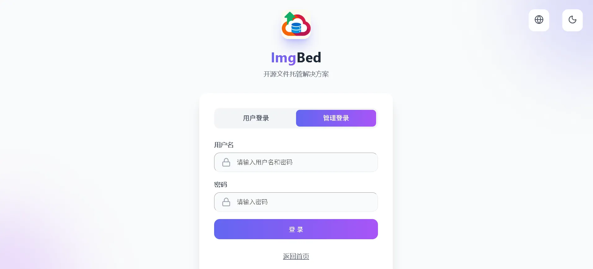
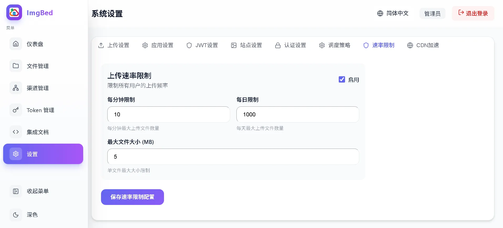
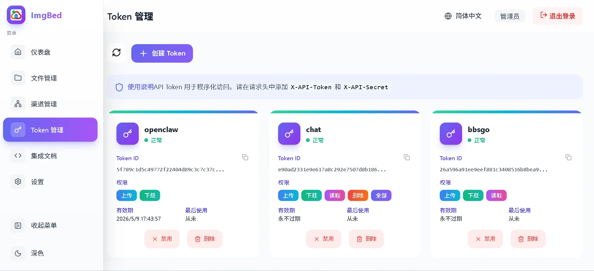
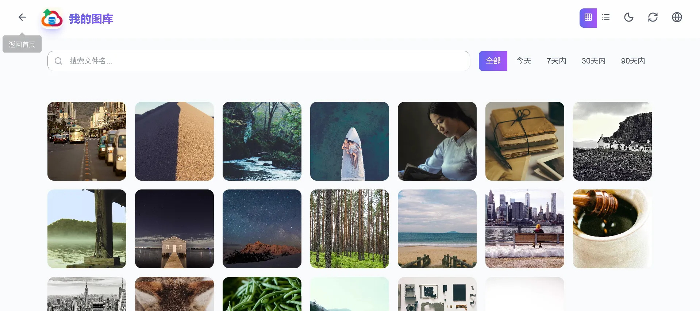

# ImgBed

Open-source image hosting aggregation tool, built with Go backend and Vue3 frontend, supporting multiple storage channels, providing simple and easy-to-use image upload and external link management capabilities.

## Demo Website

[https://imgbed.mageg.cn/](https://imgbed.mageg.cn/)

## Language Versions

- [中文版本](README.md)

## Product Screenshots

### Main Interface



### File Management



### Channel Management



### Channel Configuration



### Statistics Report



### Login Interface



### System Settings



### API Token Management



### Gallery



## Features

### Core Features

| Feature | Description |
|---------|-------------|
| **Multi-channel Storage** | Support local storage, Telegram Channel, Cloudflare R2, S3 compatible (AWS/MinIO/Alibaba Cloud OSS), Discord, HuggingFace Dataset |
| **Image Compression** | Automatic compression before upload, support WebP format conversion, configurable compression quality and maximum size |
| **Intelligent Scheduling** | Support round_robin, random, and priority strategies, automatically switch to available channels |
| **Failover Retry** | Automatically try other channels on upload failure, preventing service interruption due to single channel failure |
| **Multi-format Links** | Return URL, Markdown, and HTML format links after successful upload |
| **Quick Upload** | Based on SHA-256 checksum, existing files can be skipped directly |

### Upload Features

| Feature | Description |
|---------|-------------|
| **Normal Upload** | Support drag and drop, paste, multiple files upload simultaneously |
| **Batch Upload** | Select multiple files at once, batch processing |
| **Paste Upload** | Support Ctrl+V paste clipboard images |
| **Upload Progress** | Real-time upload progress display |
| **Quick Upload Acceleration** | Existing files directly return links without repeated upload |
| **Rate Limiting** | IP-based upload frequency limit |

### File Management

| Feature | Description |
|---------|-------------|
| **File List** | Pagination display, support thumbnail/list view switching |
| **Search and Filter** | Support file name search, channel filter (`c:channelName`), source filter (`s:source`), time range filtering |
| **Quick Filter** | Support today, 7 days, 30 days, 90 days quick presets |
| **Batch Operations** | Support select all current page, batch delete |
| **One-click Cleanup** | One-click delete all files before specified time range |
| **Link Copy** | One-click copy file links |
| **Image Preview** | Click files to preview online |

### Channel Management

| Feature | Description |
|---------|-------------|
| **Channel Configuration** | Add, edit, delete, enable/disable storage channels |
| **Channel Weight** | Set upload weights for different channels |
| **Health Check** | Batch detect channel availability |
| **Connection Test** | Test channel connection after configuration |
| **Quota Control** | Support daily/hourly upload limits, quota limits |
| **Cooling Mechanism** | Automatically enter cooling period after failure, automatically recover after a period of time |

### Authentication and Security

| Feature | Description |
|---------|-------------|
| **Access Password** | Set management background access password |
| **API Token** | Create, delete, enable/disable API Token |
| **Permission Control** | Token fine-grained permission control (upload/upload:multiple/read/delete) |
| **IP Rate Limiting** | Upload IP-level rate limiting protection |
| **CORS** | Cross-domain access support |
| **CSRF Protection** | Form submission CSRF token protection |
| **Security Headers** | X-Frame-Options, X-Content-Type-Options and other security response headers |

### Statistics Report

| Feature | Description |
|---------|-------------|
| **Overview Statistics** | Total files, total size, today's uploads |
| **Channel Statistics** | Upload success/failure count, success rate for each channel |
| **Usage Trends** | Daily/weekly upload volume trend charts |

### Data Backup

| Feature | Description |
|---------|-------------|
| **Auto Backup** | Daily automatic database backup, no manual operation required |
| **Manual Backup** | One-click database backup creation |
| **Backup Management** | View backup list, delete unnecessary backups |
| **Data Recovery** | Restore database from backup files |

### Third-party Integration

Support Typora, VS Code, Python, JavaScript and other client integrations, see the "Integration Examples" page in the management backend.

### Frontend Features

| Feature | Description |
|---------|-------------|
| **Multi-language** | Support Chinese, English |
| **Theme Switch** | Support light/dark mode |
| **Responsive Design** | Adapt to desktop and mobile devices |

## Technology Stack

### Backend
- Go 1.25+
- Gin (Web framework)
- GORM (ORM)
- SQLite (Database)
- Viper (Configuration management)
- Zap (Logging)
- github.com/deepteams/webp (WebP encoding, pure Go no CGO required)
- github.com/disintegration/imaging (Image resizing)

### Frontend
- Vue 3 (Composition API + `<script setup>` syntax)
- Vite (Build tool)
- Element Plus (UI component library)
- Tailwind CSS (Styling)
- Pinia (State management)
- Vue Router (Routing)
- ECharts (Charts)

## Quick Start

### Development Environment

```bash
# Install frontend dependencies and build
cd admin && npm install && npm run build
cd ../site && npm install && npm run build

# Start backend
cd server && go run .
```

### Build

```bash
# Build all (frontend + backend)
make build
```

## Configuration

ImgBed will create a database file after running, the location varies by platform:

| Platform | Database Path |
|----------|---------------|
| Windows | `%APPDATA%\ImgBed\imgbed.db` |
| macOS | `~/Library/Application Support/ImgBed/imgbed.db` |
| Linux | `~/.imgbed/imgbed.db` |

All configurations are modified online through the management backend interface, no need to edit configuration files.

## API Interface

| Interface | Method | Description |
|-----------|--------|-------------|
| `/api/v1/auth/login` | POST | User login |
| `/api/v1/auth/admin/login` | POST | Admin login |
| `/api/v1/upload` | POST | Upload file (requires authentication) |
| `/api/v1/upload/multiple` | POST | Batch upload |
| `/api/v1/file/check/:checksum` | GET | Quick upload check |
| `/api/v1/files` | GET | File list |
| `/api/v1/files` | DELETE | Batch delete |
| `/api/v1/files/cleanup` | POST | One-click cleanup |
| `/api/v1/tokens` | GET/POST/DELETE | Token management |
| `/api/v1/channel` | GET/POST | Channel management |
| `/api/v1/stats/overview` | GET | Statistics overview |
| `/api/v1/config` | GET/PUT | Configuration management |

Detailed API documentation can be found in [PRD.md](./docs/PRD.md)

## Ports

| Service | Port |
|---------|------|
| Backend API | 8080 |

## License

MIT